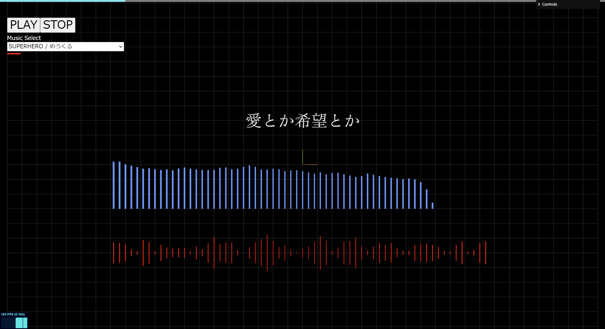

# FFT&Wave Sample -TextAlive-



楽曲のFFTと波形情報をTextAliveと連携させたサンプルサイトです。

This is a sample site that links the FFT and waveform information of a song to TextAlive.

## Demo

https://misora.main.jp/ea4azmyb/fftwave/

## Getting Started
Download and install Node.js on your computer (https://nodejs.org/en/download/).

Then, open VSCODE, drag the project folder to it. Open VSCODE terminal and install dependencies (you need to do this only in the first time)
```
npm install
```

Run this command in your terminal to open a local server at localhost:8080
```
npm run dev
```

## Song

『初音ミク「マジカルミライ 2023」楽曲コンテスト』の受賞作品6曲

https://magicalmirai.com/2023/procon/

## Resource

Three.js

TextAlive.api